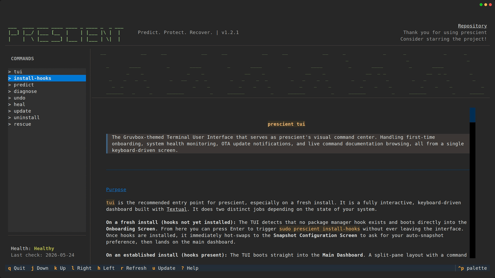

# Prescient

> **Predict. Protect. Recover.**


---



---

## Table of Contents

- [The Problem](#the-problem)
- [The Solution](#the-solution)
- [Quick Demo](#quick-demo)
- [Installation](#installation)
- [Core Features](#core-features)
- [Usage](#usage)
- [How It Works](#how-it-works)
- [Roadmap](#fossHack-2026-roadmap)
- [Contributing](#contributing)
- [Testing](#contributing)
- [License](#license)

---

## The Problem

Every Linux user knows the anxiety of `sudo apt upgrade`. Updates silently break kernel modules, NVIDIA drivers mismatch, Secure Boot complicates everything. Linux fails predictably, but no one checks the engine before hitting the gas.

## The Solution

Prescient hooks directly into your package manager (`apt`, `pacman`) and intercepts every transaction before it executes. It audits incoming packages in under 200ms, cross-references kernels against DKMS dependencies and Secure Boot state, and pulls the emergency brake if the update will brick your system. If it already broke, it recovers it.

---

## Quick Demo


### 📹 Full demo video coming soon - [watch here](https://github.com/GurKalra/prescient-linux) once published.

---

## Core Features

- **Vanguard Engine** - Intercepts `apt`/`pacman` transactions. Audits `/boot` space, `dpkg` health, mirror reachability, DKMS collisions, and Secure Boot state before a single file is written.
- **Heuristic Intelligence** - Dynamically scans unknown packages against 20 critical filesystem tripwires. Learns new threats and persists them to config memory.
- **Recovery Guardrails** - Context-aware Timeshift/Snapper snapshots triggered only on genuinely high-risk transactions. Persists state to `/var/lib/prescient`.
- **Atomic Rollback** - `prescient undo` restores the root filesystem to the exact pre-update snapshot via a safety-gated TTY prompt.
- **Pattern Interpretation** - `prescient diagnose` parses `journalctl` from the current or previous boot and ranks failing subsystems by error count.
- **Auto-Healer** - `prescient heal` maps log failures to remediation playbooks and proposes exact bash fixes before executing anything.
- **Initramfs Rescue** - `prescient-rescue` is embedded in the kernel RAM disk. Recovers completely unbootable systems from the `(initramfs)` prompt without D-Bus or systemd.
- **TTY Pastebin Exporter** - `prescient diagnose --share` pushes crash reports to `termbin.com` via raw TCP socket. Offline fallback saves locally with `0o600` permissions.
- **Mirror Pre-Flight** - Concurrently pings APT `.list`, DEB822 `.sources`, and Pacman mirrorlist configs before transactions begin. Fails open on partial degradation.
- **Gruvbox TUI** - Keyboard-driven dashboard with live health status, OTA update detection, onboarding flow, and full command documentation.

---

## Installation

```bash
curl -sSL https://raw.githubusercontent.com/GurKalra/prescient-linux/main/install.sh | bash
```

Requires Python 3.11+, `git`, and `make`. Works on Debian/Ubuntu (`apt`) and Arch Linux (`pacman`).

---

## Usage

Once hooks are installed, Prescient runs automatically on every `sudo apt upgrade` or `pacman -Syu`. For manual use:

| Command                                                     | Description                                     |
| ----------------------------------------------------------- | ----------------------------------------------- |
| [`prescient tui`](docs/commands/tui.md)                     | Open the visual dashboard and documentation hub |
| [`prescient install-hooks`](docs/commands/install-hooks.md) | Wire Prescient into your package manager        |
| [`prescient predict`](docs/commands/predict.md)             | Run a manual pre-flight audit                   |
| [`prescient diagnose`](docs/commands/diagnose.md)           | Parse boot logs (`--share`, `--previous`)       |
| [`prescient heal`](docs/commands/heal.md)                   | Auto-propose and execute service fixes          |
| [`prescient undo`](docs/commands/undo.md)                   | Roll back to the last pre-update snapshot       |
| [`prescient-rescue`](docs/commands/rescue.md)               | Recover from the `(initramfs)` prompt           |
| [`prescient update`](docs/commands/update.md)               | Pull the latest OTA update from GitHub          |
| [`prescient uninstall`](docs/commands/uninstall.md)         | Complete self-destruct sequence                 |

---

## How It Works

```
sudo apt upgrade
       │
       ▼
 DPkg::Pre-Install-Pkgs hook fires
       │
       ▼
 ┌─────────────────────────────────┐
 │       The Vanguard Engine       │
 │  1. Pre-flight (dpkg, disk,     │
 │     mirrors)                    │
 │  2. Package sanitization        │
 │  3. Boot + Security probes      │
 │  4. Blast radius assessment     │
 │  5. Heuristic tripwire scan     │
 │  6. Snapshot guardrails         │
 └─────────────┬───────────────────┘
               │
       ┌───────┴────────┐
       ▼                ▼
   SAFE ✓           VETO ✗
  Proceed          Exit code 1
                   apt aborts
```

---

## Contributing and Testing

Read the [Contributing Guide](CONTRIBUTING.md) to set up a dev environment and find open issues.

```bash
pip install -e ".[dev]"
pytest tests/ -v
```

No root required. No real packages touched. See [TESTING.md](TESTING.md) for the full zero-I/O testing philosophy.

---

## License

This project is open-source and available under the **MIT License**. You are free to copy, modify, and distribute this software, as long as the original copyright and license notice are included.

See the [LICENSE](LICENSE) file for more details.
